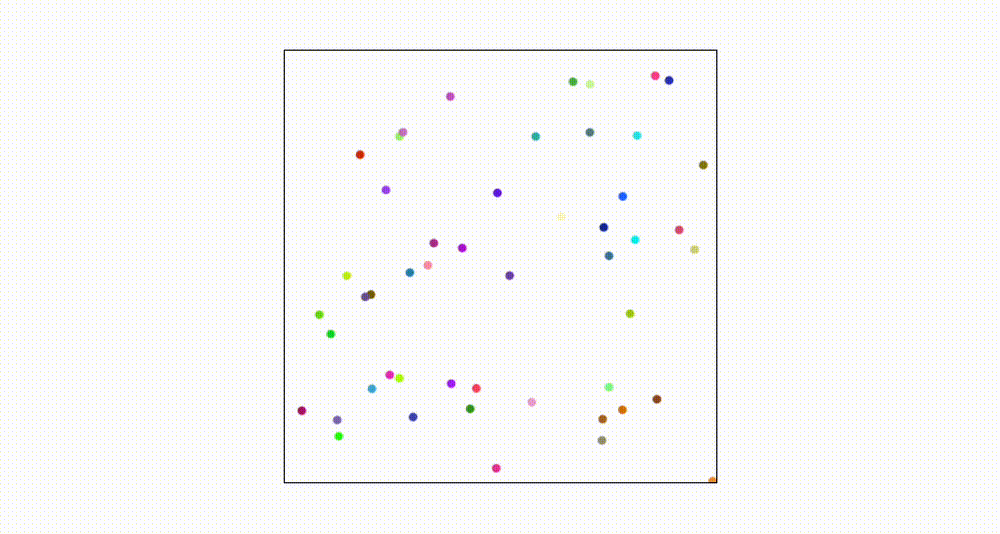

# rue

> *rust, vue, vite, wasm and having fun*

<a href="https://github.com/monsieurbadia/rue"></a>

a small project to understand how to use a canvas from the rust side?

## Start

we need to run this in two terminal, the first one is to watch the changes from rust. the second one is to watch the changes from vue.

**terminal 1**

```sh
cd front
yarn watch
```

**terminal 2**

```sh
cd front
yarn dev
```

then we can see the changes in the browser: [http://localhost:3000](http://localhost:3000)

## License

[MIT](./LICENSE)
